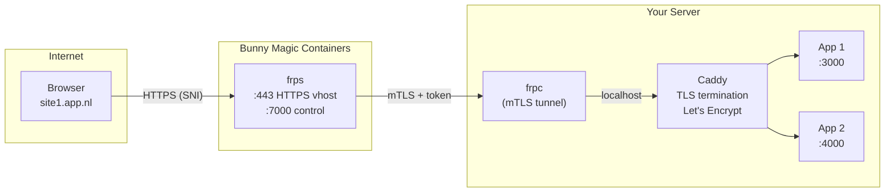

# frp-bunny

Hardened [frp](https://github.com/fatedier/frp) server (`frps`) Docker image designed for [Bunny Magic Containers](https://bunny.net/magic-containers/). Routes HTTPS traffic via SNI to frpc clients running alongside Caddy (or any reverse proxy). Secrets are passed via environment variables at runtime — nothing is baked into the image.

## Architecture



> frps only reads the SNI hostname from the TLS ClientHello — it never sees decrypted traffic. Caddy handles TLS termination and certificate management on the client side.

## Quick Start

```bash
docker run -d \
  -e FRP_TOKEN=your-secret-token \
  -p 80:80 -p 443:443 -p 7000:7000 \
  ghcr.io/quirkq/frp-bunny:latest
```

This starts frps with HTTPS vhost on 443, HTTP vhost on 80, and frpc control on 7000. Traffic is routed by domain (SNI/Host header) — multiple sites share the same ports. Caddy handles HTTP→HTTPS redirects and ACME challenges on the client side.

## Environment Variables

| Variable | Required | Default | Description |
|---|---|---|---|
| `FRP_TOKEN` | Yes | — | Auth token shared between frps and frpc |
| `PUID` | No | `1000` | UID for the frps process |
| `PGID` | No | `1000` | GID for the frps process |
| `BIND_PORT` | No | `7000` | Port frpc clients connect to |
| `VHOST_HTTPS_PORT` | No | `443` | HTTPS vhost port (SNI-based domain routing) |
| `VHOST_HTTP_PORT` | No | `80` | HTTP vhost port (for redirects and ACME challenges) |
| `MAX_PORTS_PER_CLIENT` | No | `0` | Max TCP ports a client can bind (`0` = disabled) |
| `MAX_POOL_COUNT` | No | `5` | Max connection pool size per proxy |
| `ALLOW_PORTS` | No | *(empty)* | TCP port ranges clients may bind (e.g. `20000-30000`) |
| `SUBDOMAIN_HOST` | No | *(unset)* | Base domain for subdomain routing (e.g. `app.nl`) |
| `DASHBOARD_PASSWORD` | No | *(unset)* | Enables the dashboard when set |
| `DASHBOARD_USER` | No | `admin` | Dashboard login username |
| `DASHBOARD_PORT` | No | `7500` | Dashboard port |
| `DASHBOARD_ADDR` | No | `127.0.0.1` | Dashboard bind address |
| `ENABLE_PROMETHEUS` | No | `false` | Expose Prometheus metrics at `/metrics` (requires dashboard) |
| `TLS_CERT_FILE` | No | `/etc/frp/tls/server.crt` | Server TLS certificate path |
| `TLS_KEY_FILE` | No | `/etc/frp/tls/server.key` | Server TLS private key path |
| `TLS_CA_FILE` | No | `/etc/frp/tls/ca.crt` | CA certificate for mTLS client verification |
| `TLS_CERT_B64` | No | *(unset)* | Base64-encoded server certificate (alternative to mounting files) |
| `TLS_KEY_B64` | No | *(unset)* | Base64-encoded server private key |
| `TLS_CA_B64` | No | *(unset)* | Base64-encoded CA certificate |
| `HEALTH_PORT` | No | `8080` | HTTP health check port (`0` to disable) |

## Client Setup with Caddy

The recommended setup uses frpc alongside Caddy on your server. frps passes HTTPS traffic through transparently (SNI routing) — Caddy handles TLS termination and gets its own Let's Encrypt certificates.

### frpc.toml

```toml
serverAddr = "your-server-ip"
serverPort = 7000

auth.token = "your-secret-token"
transport.tls.enable = true
transport.tls.certFile = "/path/to/client.crt"
transport.tls.keyFile = "/path/to/client.key"
transport.tls.trustedCaFile = "/path/to/ca.crt"
loginFailExit = false

# Each domain needs both HTTPS (traffic) and HTTP (redirects + ACME)
[[proxies]]
name = "site1-https"
type = "https"
localIP = "127.0.0.1"
localPort = 443
customDomains = ["site1.app.nl"]

[[proxies]]
name = "site1-http"
type = "http"
localIP = "127.0.0.1"
localPort = 80
customDomains = ["site1.app.nl"]

[[proxies]]
name = "site2-https"
type = "https"
localIP = "127.0.0.1"
localPort = 443
customDomains = ["site2.app.nl"]

[[proxies]]
name = "site2-http"
type = "http"
localIP = "127.0.0.1"
localPort = 80
customDomains = ["site2.app.nl"]
```

### Caddyfile

```caddyfile
site1.app.nl {
    reverse_proxy localhost:3000
}

site2.app.nl {
    reverse_proxy localhost:4000
}
```

Caddy automatically obtains and renews Let's Encrypt certificates for each domain.

### DNS

Point each domain to the frps server:

```
site1.app.nl  A  your-server-ip
site2.app.nl  A  your-server-ip
```

### Flow

```
1. Browser → HTTPS → your-server-ip:443
2. frps reads SNI header (site1.app.nl), routes to the frpc that registered that domain
3. frpc forwards to Caddy on localhost:443
4. Caddy terminates TLS, proxies to your app on localhost:3000
```

frps never sees the decrypted traffic — it only reads the SNI hostname from the TLS ClientHello.

## Health Check

An HTTP health endpoint runs on port `8080` (configurable via `HEALTH_PORT`). Use it for platform health probes:

- **URL:** `http://<container>:8080/cgi-bin/health`
- Returns `200 OK` when frps is running, `503` otherwise
- Works with mTLS since it's a separate plain HTTP server, not the frp control port

For Bunny Magic Containers, set all three probes (Startup, Readiness, Liveness) to **HTTP GET** on port **8080** path `/cgi-bin/health`.

Set `HEALTH_PORT=0` to disable the health server entirely.

## TLS and mTLS

By default, TLS is required between frpc and frps (`transport.tls.force = true`), but uses frp's built-in auto-generated certificates. This encrypts traffic but doesn't verify identity — an attacker could MITM the connection and brute-force the token.

For production, mount proper certificates to enable server identity verification and optionally mTLS (mutual TLS) for client certificate authentication. frp uses its own TLS transport, so certificates are **not domain-bound** — self-signed certs work fine.

### Generating certificates

A helper script is included to generate all certificates at once:

```bash
# Default: 1 server cert, 1 client cert, new CA
./generate-certs.sh

# 2 servers, 5 clients
./generate-certs.sh -s 2 -c 5

# Use an existing CA
./generate-certs.sh -c 3 --ca-cert ./ca.crt --ca-key ./ca.key

# Custom output dir, key size, and validity
./generate-certs.sh -d ./my-certs -b 2048 -y 5
```

Run `./generate-certs.sh --help` for all options. The script automatically sets restrictive file permissions (`700` on the directory, `600` on private keys).

This gives you:

| File | Goes on | Purpose |
|---|---|---|
| `ca.crt` | Server + all clients | CA certificate — both sides verify certs against this |
| `ca.key` | **Keep offline/safe** | Only needed to sign new certs |
| `server.crt` + `server.key` | Server (frps) | Server identity |
| `client.crt` + `client.key` | Client (frpc) | Client identity |

### Server setup (frps)

Mount the three server files into the container:

```bash
docker run -d \
  -e FRP_TOKEN=your-secret-token \
  -v ./certs/ca.crt:/etc/frp/tls/ca.crt:ro \
  -v ./certs/server.crt:/etc/frp/tls/server.crt:ro \
  -v ./certs/server.key:/etc/frp/tls/server.key:ro \
  -p 443:443 -p 7000:7000 \
  ghcr.io/quirkq/frp-bunny:latest
```

The entrypoint auto-detects the mounted certs:
- `server.crt` + `server.key` present → enables server TLS identity
- `ca.crt` also present → enables **mTLS** (clients must present a valid certificate)

Alternatively, pass certificates as base64-encoded environment variables (useful for platforms that don't support volume mounts, like Bunny Magic Containers):

```bash
docker run -d \
  -e FRP_TOKEN=your-secret-token \
  -e TLS_CERT_B64=$(base64 < certs/server.crt) \
  -e TLS_KEY_B64=$(base64 < certs/server.key) \
  -e TLS_CA_B64=$(base64 < certs/ca.crt) \
  -p 443:443 -p 7000:7000 \
  ghcr.io/quirkq/frp-bunny:latest
```

The `_B64` env vars are decoded to files at startup. If both a mounted file and a `_B64` var exist, the decoded env var takes precedence.

With mTLS enabled, even if an attacker obtains the token, they cannot connect without a valid client certificate signed by your CA.

## Deploy on Bunny Magic Containers

1. Push the image to GHCR (the GitHub Actions workflow does this automatically on every push to `main`).
2. In the [bunny.net dashboard](https://dash.bunny.net), go to **Magic Containers** and create a new app.
3. Set the container image to `ghcr.io/quirkq/frp-bunny:latest`.
4. Add environment variables: `FRP_TOKEN`, and optionally `TLS_CERT_B64`, `TLS_KEY_B64`, `TLS_CA_B64` for mTLS.
5. Add endpoints:
   - Port **443** — HTTPS vhost traffic (public)
   - Port **7000** — frpc control connection (public)
   - Port **8080** — health checks (internal)
6. Set health probes to **HTTP GET** on port **8080** path `/cgi-bin/health`.
7. Use **Single Region** deployment — multiple frps instances can't share the same ports.

Note the public IP assigned to your endpoint — this is your `serverAddr` for frpc and where you point DNS.

## Image Tags

| Tag | Description |
|---|---|
| `latest` | Latest stable frp release |
| `0` | Latest 0.x |
| `0.61` | Latest 0.61.x |
| `0.61.1` | Specific frp version |

## Hardening

- HTTPS vhost routing by default — no arbitrary TCP port binding
- TLS enforced on the frpc-frps control connection
- mTLS support — auto-enabled when certs are mounted
- Token re-validated on every heartbeat and new connection (`auth.additionalScopes`)
- Connection pool capped per proxy (`transport.maxPoolCount`)
- Runs as non-root user (`frps`) with configurable UID/GID via `PUID`/`PGID`
- Compatible with `--user` / Kubernetes `securityContext` for rootless operation
- Dashboard disabled by default, bound to `127.0.0.1` when enabled
- Dashboard TLS auto-enabled when server certs are mounted
- `detailedErrorsToClient = false` prevents info leakage
- Config file generated at startup with `400` permissions
- Port and env var inputs validated; strings escaped for TOML injection prevention
- Trivy vulnerability scan on every build
- Go and Alpine versions auto-detected at build time for latest security patches
- Scheduled builds pick up new upstream frp releases automatically

## License

[Apache 2.0](LICENSE)
